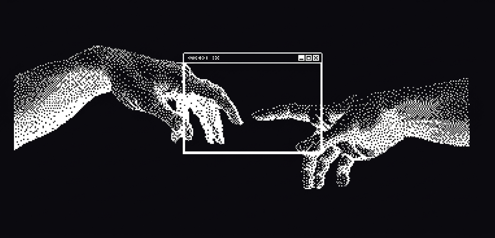

  <!-- Banner Image -->
  

  

  <!-- Hero Text -->

  <h1>Hi 👋, I'm John Phillip Lor Malbas!</h1>

  <h3><b>Software Engineer | Backend & Systems Development</b></h3>

  

  I'm a Bachelor of Science in Information Technology graduate interested in building reliable software, backend systems, and developer-focused applications. My primary interests are backend engineering, system design, clean architecture, and understanding how software works beneath high-level abstractions.

  I enjoy building projects from the ground up—from desktop applications and networking systems to data-driven applications and AI-powered tools. I'm particularly interested in C#/.NET and Python, while continuously expanding my knowledge across software architecture, databases, APIs, and AI engineering.

  

---

### 🔭 Currently Exploring

* **AI Engineering** — building practical applications around LLMs, RAG, embeddings, and AI-powered workflows.
* **Backend Systems** — APIs, databases, networking, concurrency, and service architecture.
* **Software Architecture** — SOLID principles, separation of concerns, dependency management, and maintainable system design.
* **C# / .NET** — strengthening my understanding of application architecture, system design, and backend development.

---

### 📂 Featured Projects

 

### 🤖 **Local RAG Pipeline**

A modular, locally hosted Retrieval-Augmented Generation system that combines semantic vector retrieval with LLMs and local embeddings to provide context-aware answers over local document collections. It also explores real-time text and speech interaction.

**Tech Stack:**

**Focus:**

* Modular software design and separation of responsibilities.
* Semantic vector search and context retrieval using ChromaDB.
* LLM integration and multimodal interaction.
* Interactive application development using Streamlit.

 

### ♟️ **Chess Engine**

A desktop chess application built with C# and Raylib, focusing on board-state representation, move validation, game-state management, and implementing core engine logic from first principles.

**Tech Stack:**

**Focus:**

* Custom game and board-state management.
* Move validation and chess rules.
* Dependency management and separation of concerns.
* Understanding lower-level implementation details.

 

### 🌐 **Static Web Server**

A lightweight, multi-threaded static file server built with C# and raw TCP sockets. The project explores networking fundamentals by implementing HTTP request parsing and connection handling without relying on high-level web server abstractions.

**Tech Stack:**

**Focus:**

* HTTP/1.1 request parsing and response handling.
* TCP socket communication.
* Concurrent connection management.
* Static asset delivery and stream handling.

 

### 📝 **Notepad Clone**

A desktop text editor built with C# and WPF while exploring the Model-View-ViewModel (MVVM) design pattern, data binding, commands, and event-driven application development.

**Tech Stack:**

**Focus:**

* MVVM architecture and UI separation.
* Data binding and command-based interaction.
* File I/O and text processing.
* Event-driven desktop application development.

---

### 💻 About Me

* 🚀 Currently seeking opportunities in **software development and backend engineering**.
* 🎓 Bachelor of Science in **Information Technology** graduate from **Bulacan Agricultural State College (BASC)**.
* 🛠️ Interested in **software architecture, SOLID principles, system design, and maintainable software**.
* 🧠 I enjoy building core logic and systems from the ground up to better understand how they work under the hood.
* 🤖 Exploring **AI engineering, LLM applications, RAG, and intelligent software systems**.

---

### 📊 GitHub Metrics & Insights

  <table border="0">
    <tr>
      <td align="center" valign="top" width="50%">
        
      </td>

  <td align="center" valign="top" width="50%">
    
  </td>
</tr>

  </table>

---

### 🛠️ Tech Stack & Tooling

**Languages**

**Backend & Frameworks**

**AI & Data**

**Frontend**

**Databases & Testing**

**DevOps & Development Tools**

**Systems & Hardware**

---

### 🧠 Engineering Philosophy

> I like software that is easy to understand, test, replace, and extend. I aim to keep responsibilities separated and dependencies explicit so that individual components can evolve without unnecessarily affecting the rest of the system.

---

---

### 📫 Connect With Me

<table>
  <tr>
    <td>
      
    </td>
    <td>
      
    </td>
    <td>
      
    </td>
    <td>
      
    </td>
  </tr>
</table>

---

---

**"An investment in knowledge always pays the best interest."**

